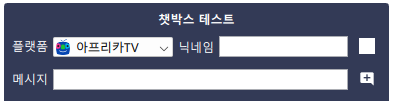

플렉스트림은 연동된 서비스의 채팅을 모아서 보여주는 챗박스를 지원합니다.

## 준비

플렉스트림의 챗박스를 설정하고 OBS를 통해서 송출하기 위해서는 별도의 플러그인 설치가 필요합니다.
자세한 설치법은  페이지를 참고해주세요.

## 챗박스 만들기

* 플렉스트림의 상단 메뉴에서 `챗박스` 메뉴를 눌러 챗박스 관리 창을 실행합니다.
* 추가  버튼을 눌러 챗박스를 추가합니다.
    - 목록에서 항목을 더블클릭하여 챗박스 이름을 변경할 수 있습니다.
    - 목록에서 삭제  버튼을 눌러 챗박스를 삭제할 수 있습니다.
* 너비와 높이를 설정합니다.
    - 너비와 높이에 맞춰서 좌측의 빨간색 테두리의 체크무늬 상자가 실시간으로 변경됩니다. 빨간색 테두리와 체크무늬 배경은 미리보기에서 챗박스의 영역을 표시하기 위한 것으로 실제로 송출 화면에는 출력되지 않습니다.
    - 만약 미리보기 창의 크기가 설정한 너비와 높이보다 작으면 비율이 유지된 채로 축소되어 표시됩니다. 실제 크기를 확인하기 위해서는 창의 크기를 충분히 크게 하고 작업해주세요.
* 스타일을 선택하고 속성을 설정합니다.
    - 스타일 별로 설정가능한 속성이 다릅니다. 속성을 변경하면 실시간으로 반영됩니다.
    - 속성별로  버튼을 누르면 플랫폼별 속성값을 설정할 수 있습니다. `(상속)`이라고 표시되어 있는 값은 기본 스타일의 값을 따라갑니다.
    - 각 속성에 커서를 올렸을 때 표시되는  버튼을 누르면 초기값으로 돌릴 수 있습니다.

## 챗박스 테스트

* 챗박스 미리보기의 챗박스 테스트를 통해서 테스트 채팅을 생성할 수 있습니다.

* 생성된 채팅은 플렉스트림의 챗박스에 실제로 표시되지만 해당 플랫폼에 표시되지는 않습니다.

## 챗박스 송출

* 만든 챗박스는 Spout 인터페이스로 외부 프로그램과 연동이 가능합니다.
* OBS로 송출하는 경우,  페이지를 참고하여 OBS Spout2 플러그인을 설치합니다.
* Spout2 Capture 소스로 생성한 챗박스를 불러옵니다.
    - `SpoutSenders`에 해당하는 이름은 챗박스 관리 창의 `Spout2` 값을 통해 확인할 수 있습니다.
    - 플렉스트림의 챗박스 Spout2 인터페이스 이름은 항상 `PLEXChatBox/...`의 형식입니다.
* 플렉스트림을 종료하면 챗박스 송출도 함께 중단됩니다. 단, 플렉스트림 창을 닫아도 프로그램이 바로 종료되지 않고 시스템 트레이를 통해서 계속해서 이용가능합니다.
