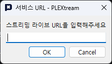

플렉스트림은 다양한 플랫폼 서비스를 지원하여 동시 송출하는 스트리머를 보조할 수 있습니다.
플렉스트림 창의 상단 메뉴에서 `연동` 메뉴를 실행하거나, 시스템 트레이 아이콘 메뉴에서 `서비스 연동` 메뉴를 실행하면 서비스 연동 창을 열 수 있습니다.

## 서비스 추가하기

서비스 연동 창의  버튼을 누르면 서비스 URL 창이 표시됩니다. 연동할 서비스의 URL을 입력해주세요.

입력하는 URL은 연동하는 플랫폼의 방송국 또는 채널 주소입니다.

* 아프리카TV 방송국: `https://bj.afreecatv.com/사용자ID`
* 치지직 채널: `https://chzzk.naver.com/사용자해시`
* 트위치 채널: `https://www.twitch.tv/사용자ID`
* 유튜브 채널: `https://www.youtube.com/@채널핸들`

서비스가 추가되면 목록에서 추가된 서비스가 플랫폼 아이콘과 함께 표시됩니다.
각 항목에 대해서 다음과 같은 버튼을 이용할 수 있습니다.

---

준비중입니다.

---
