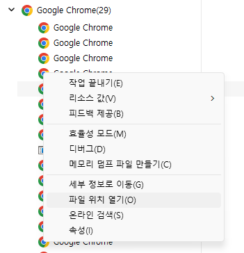
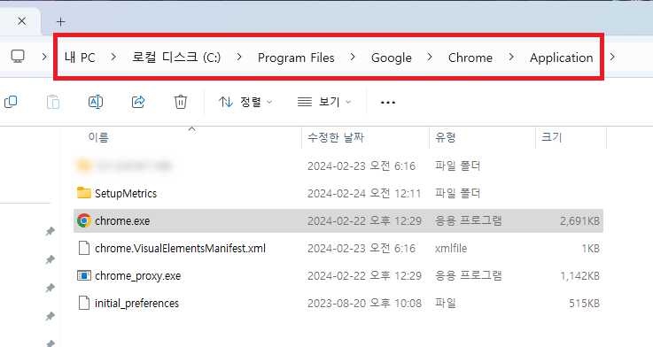
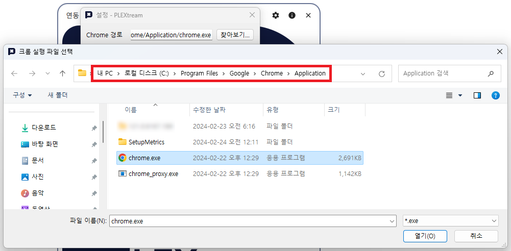

플렉스트림 메인 창의 상단의  버튼 또는 시스템 트레이 아이콘의 설정 메뉴를 통해 설정 창을 열 수 있습니다.
일부 설정은 플렉스트림을 재시작해야 적용되기 때문에 설정을 수정한 경우에는 플렉스트림을 재시작하는게 좋습니다.

## 일반 설정

### Chrome 경로 {#chrome-path}

플렉스트림의 일부 기능은 사용자의 PC에 설치된 Google Chrome에 의존합니다.
Google Chrome이 기본 경로에 설치된 경우 자동으로 인식합니다.
만약 Chrome 경로와 관련한 오류가 발생할 경우, 직접 Chrome 경로를 설정해주세요.

#### Chrome 경로 찾기

Google Chrome 경로는 다음과 같은 방법으로 찾을 수 있습니다.

1. Google Chrome을 실행합니다.
1. 작업 관리자를 실행합니다. 작업관리자는 `CTRL + Win + ESC` 키 조합으로 열 수 있습니다.
1. 작업 관리자에서 Google Chrome 항목을 찾습니다.
1. Google Chrome 항목을 더블클릭하여 펼치면 아래 이미지와 같이 여러개의 Google Chrome 하부 항목들이 표시됩니다. 아무 하부 항목을 우클릭하고 파일 위치 열기 메뉴를 선택합니다.

1. 탐색기가 열리고 아래와 같이 `chrome.exe`가 표시됩니다.

1. 탐색기 상단의 경로를 확인하고, 설정창에서 `찾아보기...` 버튼으로 해당 경로의 `chrome.exe` 파일을 선택합니다.

### 시스템 트레이

* [ ] 시작시 자동으로 시스템 트레이에서 실행
    - 윈도우 시작과 함께 시스템 트레이를 통해 플렉스트림이 자동으로 실행됩니다.
      플렉스트림을 매번 실행하는 것이 번거로운 경우 이 설정을 적용할 수 있습니다.
* [x] 창을 닫으면 시스템 트레이로 최소화
    - 플렉스트림 창을 닫았을 때 프로그램을 종료하는 대신 시스템 트레이에서 계속해서 실행되도록 합니다.
      실수로 플렉스트림을 종료하는 것을 방지하기 위해서 기본으로 체크되어 있습니다.

## 고급 설정

### NTP 서버

플렉스트림은 내부적으로 정확한 현재 시간에 의존하는 기능이 많기 때문에 인터넷을 통해 시간을 자동으로 동기화합니다.
NTP 서버는 정확한 시간 정보를 제공해주는 서버입니다.
만약 기본값으로 지정된 NTP 서버가 작동하지 않는 경우 직접 NTP 서버를 변경할 수 있습니다.

## 로컬 서버 포트

플렉스트림은 사용자의 PC에서 로컬 서버를 가동하여 외부 프로그램 또는 연동 서비스와 통신합니다.
만약 다른 프로그램이 사용하는 포트 번호와 중복되는 경우, 다른 포트 번호를 지정할 수 있습니다.
